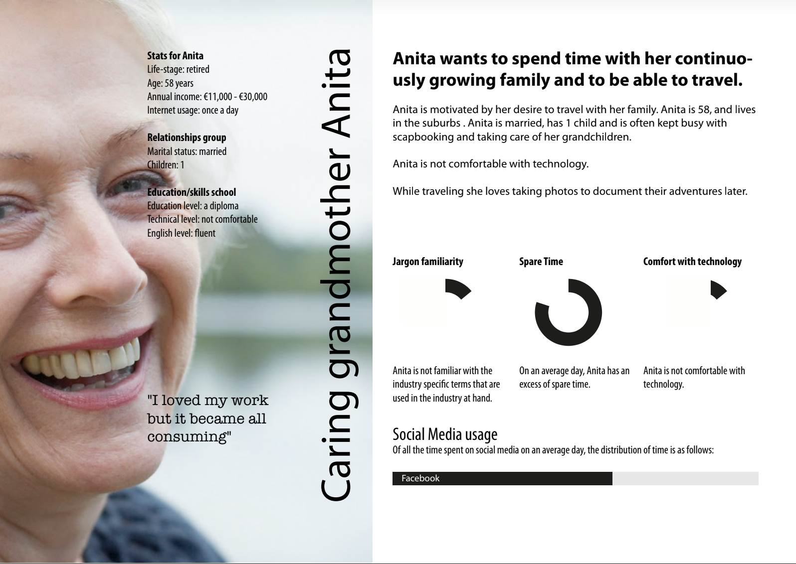

# Introduction
**Topic:  Finance** 
**Persona: Anita**

| Learning Outcome                             | Deliverables                                                 |
| -------------------------------------------- | ------------------------------------------------------------ |
| Problem definition / Concepting              | - **Empathy**: Brainstorm *(In poster below)*  - **Ideation**: [Storyboard](https://drive.google.com/file/d/1NVVubuyR4WYRHpsbfPtrKvKxMQQQ6Dwd/view?usp=sharing)   |
| Mobile User Experience / Interaction Designs | - **Define**: [Paper Wireframe] *(In poster below)* - **Define**: Competitive Analysis *(in poster below)* - **Test&Prototype**: [Paper prototyping](https://www.youtube.com/watch?v=C0hlR0ZkNz4) |
| Professional Skills                          | - **Presentation**: [PPT](https://docs.google.com/presentation/d/1eo4FdNCXUdpD7HPupJrBYQrUu22sKFBP/edit?usp=sharing&ouid=114335679009072858418&rtpof=true&sd=true) - **Poster**: [Poster](https://drive.google.com/file/d/1_Rdu4YWNvaQ1RHdZHuFeIvxGeBZ5AtXD/view?usp=sharing) |

#### Research Methods/Tools Applied 

- Persona	

- Prototype

- Storyboard

- Design Specification

- Competitive Analysis

- Wireframe

**Poster**
---

