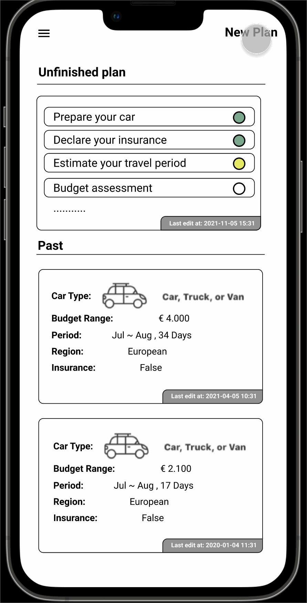
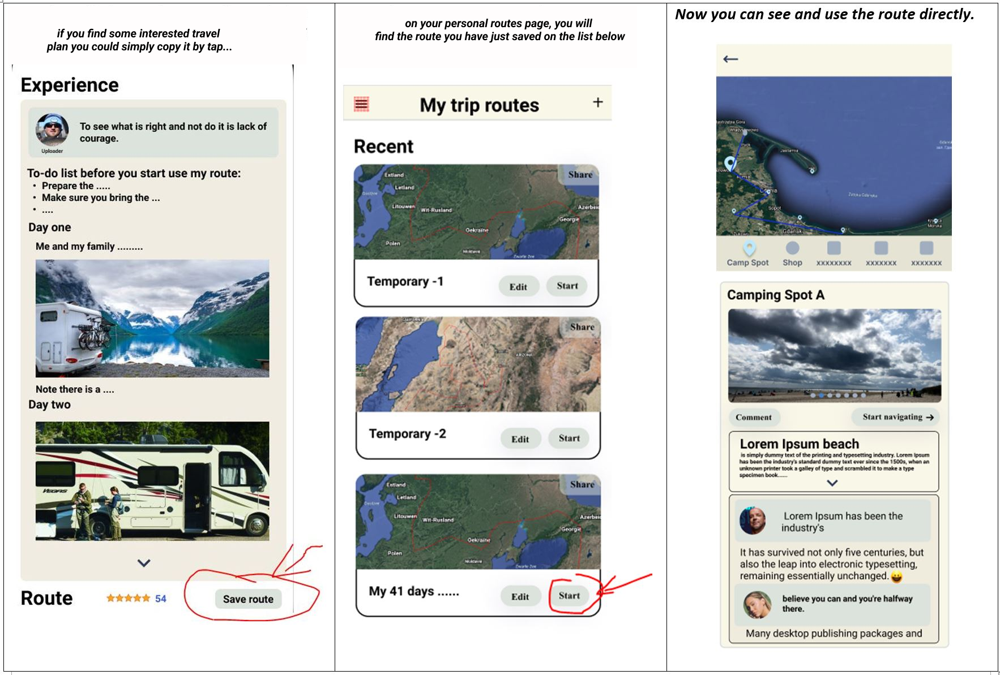
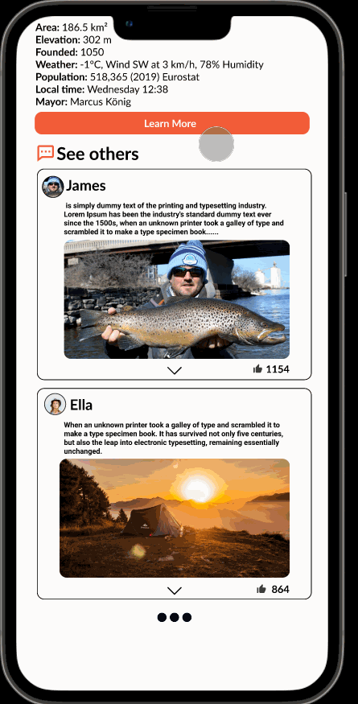
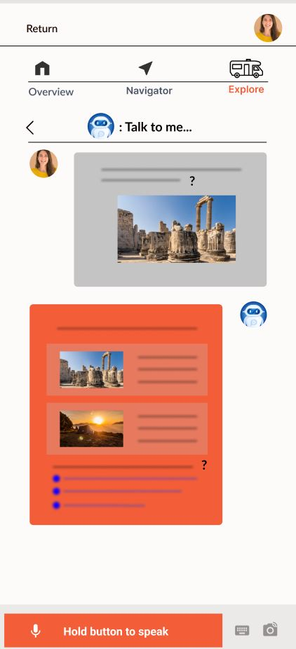
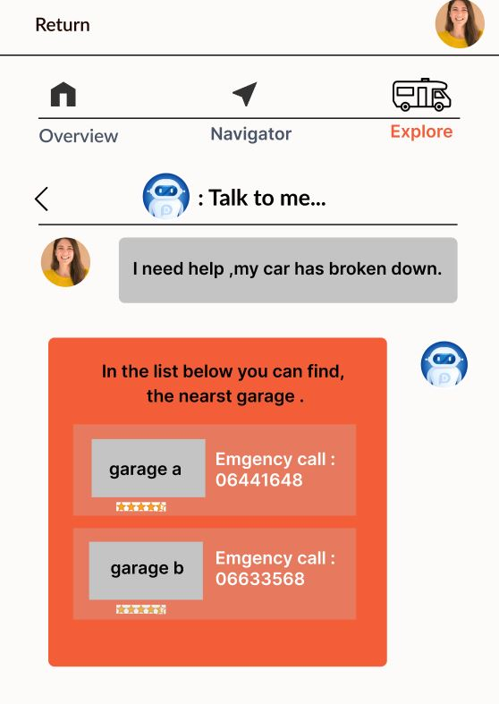
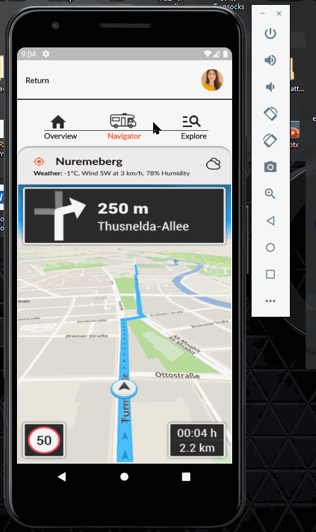

# Q & A

|                                                              |
| ------------------------------------------------------------ |
| Q - 1: [Hey, I have no ideas for plan my trip can it help me ?](https://git.fhict.nl/I443880/shenghangzhu-smartmobile-portfolio/-/wikis/PWA-Phase-Project#q-1-hey-i-have-no-ideas-for-planning-my-trip-can-it-help-me) |
| Q - 2:  [Is there an easy way that can help me to borrow other trip routes](https://git.fhict.nl/I443880/shenghangzhu-smartmobile-portfolio/-/wikis/PWA-Phase-Project#q-2-is-there-an-easy-way-that-can-help-me-to-borrow-others-trip-routes)  ? |
| Q - 3: [Can I customized trip route it manually ?](https://git.fhict.nl/I443880/shenghangzhu-smartmobile-portfolio/-/wikis/PWA-Phase-Project#q-3-can-i-customize-the-trip-route-manually) |
| Q - 4:  [What if I want randomly go on a trip start from somewhere just want to plan it during the trip, is it can give me some help?](https://git.fhict.nl/I443880/shenghangzhu-smartmobile-portfolio/-/wikis/PWA-Phase-Project#q-4-what-if-i-want-randomly-go-on-a-trip-start-from-somewhere-just-want-to-plan-it-during-the-trip-is-it-can-give-me-some-help) |
| Q - 5:  [How can I  know more about the local story or the place I am going to visit ?](https://git.fhict.nl/I443880/shenghangzhu-smartmobile-portfolio/-/wikis/PWA-Phase-Project#q-5-how-can-i-know-more-about-the-local-story-or-the-place-i-am-going-to-visit) |
| Q - 6:  [How does it help me solve problems I encounter on the go ?](https://git.fhict.nl/I443880/shenghangzhu-smartmobile-portfolio/-/wikis/PWA-Phase-Project#q-6-how-does-it-help-me-solve-problems-i-encounter-on-the-go) |
| Q - 7:   [What else do you think is missing from these designs?](https://git.fhict.nl/I443880/shenghangzhu-smartmobile-portfolio/-/wikis/PWA-Phase-Project#q-7-what-else-do-you-think-is-missing-from-these-designs) |

# The Big Idea

Have no idea for planning your camping trip? 
Have no clues for getting the local story?
Well, we can help. 
We desired to build a camping travel companion/assistant application just for you.

​	We integrate advanced AI technology into our system to deliver the most interested and personalized camping information for the user. Not only that, it will company with the user for giving the assist, during the whole process.
​	Whatever the user would like to book a camping place or want to change their plan on the way or want to navigate to some local service spot. 
We like to give the user the ultimate solution by solving :

- The difficulty for planning a camping trip
- The troubles that happened on the trip

*Want to see how I conclude these ideas? check the post with this [link](https://www.figma.com/file/MqJfdn010puX31BFEY5fay/Clickable-prototype?node-id=301%3A7830)* in Figma.

# The Designs

**Want to see the all design detail? check this [link](https://www.figma.com/file/MqJfdn010puX31BFEY5fay/Clickable-prototype?node-id=117%3A6748)* in Figma.*

### Q 1: Hey, I have no ideas for planning my trip can it help me?

*Yes, If you have no clues for planning a trip we can recommend the most suitable content for you just by...*

### Q - 2:  Is there an easy way that can help me to borrow others trip routes?

### Q - 3:  Can I customize the trip route manually?

*Yes, I've thought about this. but haven't carefully designed interaction in detail.*

### Q - 4:  What if I want randomly go on a trip start from somewhere just want to plan it during the trip, is it can give me some help?

*Yes, our system will give recommend the most suitable information based on your current location and your personal profile or the keywords you typed in the search bar. For instance, you see a camping place "Wannsee Lake" and you want to book it ...* 

### Q - 5:  How can I  know more about the local story or the place I am going to visit?

*Yes, on the overview panel, you can preview your preset travel routes, by tapping the car/pin icon on the map you will...*

*Or if you would like to with our Ai for instance. e.g Take a photo and will give to the answer .*

### Q - 6:  How does it help me solve problems I encounter on the go? 

*Just talk to AI chat or search it by yourself on keywords* 

*e.g:*

### Q - 7:   What else do you think is missing from these designs?

- The part of the Q&A to collect the user's data and the interface was not studied in-depth and carefully, but only gave a general design idea and concept.
- Important information for the Recommended section hasn't been studied in-depth.
- Some UI from the previous design needed to be improved.
- Still, need to look into a good way to combine all these ideas/designs together.
- Other...

# Code Implementation gif
