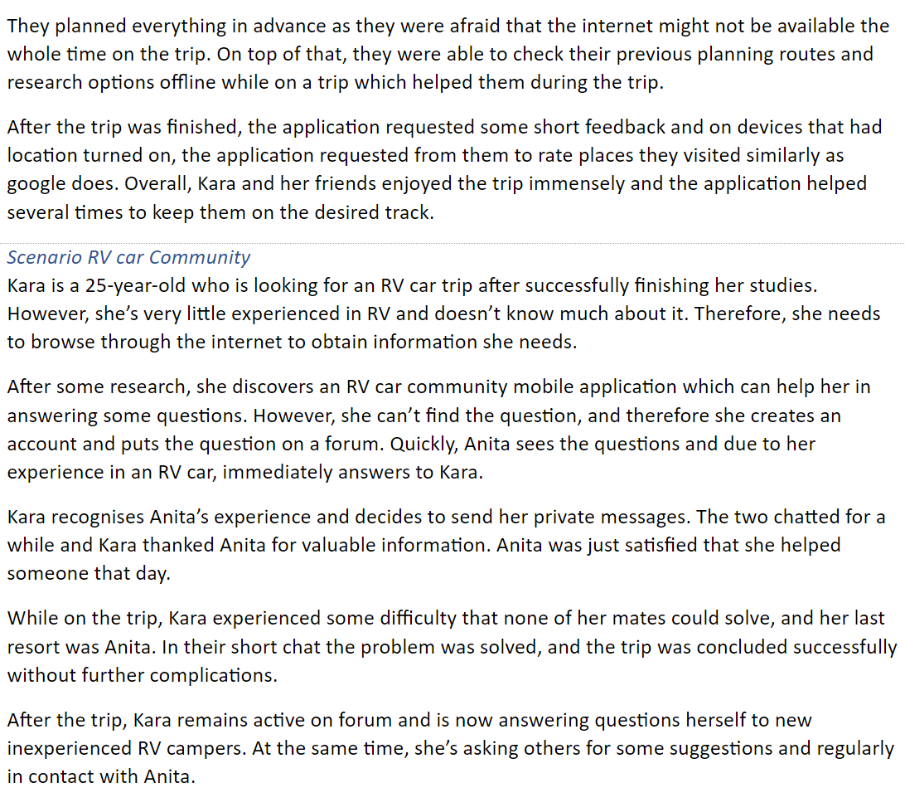

## Introduction:
You can find all the documents [here](https://drive.google.com/drive/folders/1KsFudLLPjYIyWyw2GUdn6mwv7Igta2Ff?usp=sharing) 
All the prototypes you can find [here](https://www.figma.com/file/MqJfdn010puX31BFEY5fay/Clickable-prototype?node-id=117%3A6748) 
About the presentation:Click [Here](https://docs.google.com/presentation/d/1eBjmRtImjnvZk6AXFWKnO3IMqxsAJBly/edit?usp=sharing&ouid=114335679009072858418&rtpof=true&sd=true) Get Slides 
Plan:

## Persona:

- [Kara](https://drive.google.com/file/d/1ybBof2JZQM1dG5bGq_nIogW9h4jDPU3b/view?usp=sharing)
- [Anita](https://drive.google.com/file/d/1s6tQ31CQMyNvbAPUgBFzxFgPy_rE3DKw/view?usp=sharing)

## Topic: Automotive

## 1st Iteration

### (Problem definition / Concepting --- Empathy) Method: Empathy Map

Because the initial goal is not clear, we need to get as many other requirements as possible about Persona itself, so Kara's empathy map will have a different focus under the same approach.

**Introduction:**   Use an empathy map as a starting point to analyze some of Anita&Kara's needs and pain points for vehicles.

- Anita(Zhu)
  

- Kara(Mateja) 
  

**Conclusion:**   Now we had some basic empathy of the Anita & Kara for. Base on this point we can start digging into the user's needs more deeply.

### (Problem definition / Concepting --- Define) Method: WWWWWH 

**Introduction:**  To analyze the user's daily scenario while the Persona using the vehicle.

- Anita(Zhu)
  

- Kara(Mateja) 
  

**Conclusion:**  Based on the information we have obtained, we can start analyzing and brainstorming new ideas.

### (Problem definition / Concepting --- Ideation) Method: Mind-Map

**Result:**

**Conclusion:**  After having a preliminary direction, in order to verify the ideas of different branches. We started prototyping the concepts separately.

### (Concept --- Prototype&Testing)Method: Storyboard

- VR trip (Zhu) 

- VR renting (Mateja)

## 2nd Iteration

### (Problem definition / Concepting --- Background Information Research)  - Zhu
- (Zhu) (Because the image is too large, the platform cannot be uploaded. If you cannot indent to see the details, you can click [here](https://www.figma.com/file/PL27kdPrQvHl8PvBacV45P/Untitled?node-id=0%3A1).)

- (Mateja) 

### (Problem definition / Concepting --- Define) Method: Action Map 
- (Zhu) 

- (Mateja) 

### (Problem definition / Concepting --- Ideation) Method: Lotus blossom

**Conclusion:** 
We realize that our ideas are always too scattered, so we will evaluate and verify different concepts based on user needs.
### (Problem definition / Concepting --- Prototype & Testing) Method: Harris Profile

## 3rd Iteration
Due to the holiday, we have adopted a parallel division of labor to complete our respective tasks. While Mateja drew the Empathy map, I conduct research and investigation on the background of related fields and then summarize and analyze the results. Actor-map is drawn to show our thoughts on the application. Finally, use Mash-up and Lotus Blossom to get design inspiration.
Then present the wireframe respectively.

### (Problem definition / Concepting --- Background Information Research) - Zhu

### (Problem definition / Concepting --- Empathy) Method: Empathy Map - Mateja
- Anita

-   Kara

### (Problem definition / Concepting --- Define) Method: Actor-map - Zhu

### (Problem definition / Concepting --- Define) Method: Actor-map - Mateja

### (Problem definition / Concepting --- Define) Method: Written Scenario - Mateja

### (Problem definition / Concepting --- Ideation) Method: Mash-Up - Zhu

### (Problem definition / Concepting --- Ideation) Method: Lotus blossom - Mateja

### (Design --- Prototype) Method: Wireframe - Zhu
Introduction: Design the trip guidance and route sharing screen

### (Design --- Prototype) Method: Wireframe - Mateja

## 4th Iteration
This iteration mainly focuses on completing the prototype to verify and demonstrate our concept.
Due to time constraints, no specific method was used to complete the idea phase, but you can find some drafts and prototypes of our ideas in the following [link](https://www.figma.com/file/MqJfdn010puX31BFEY5fay/Clickable-prototype?node-id=117%3A6748).
### (Problem definition / Concepting --- Empathy Map) - Zhu

### (Problem definition / Concepting --- Behavioural lenses) - Mateja

### (Problem definition / Concepting  --- Problem Tree) - Zhu
Introduction:
To help us get on the same page, I roughly defined 4 types of problems and discussed in depth the part about prototyping.

### (Design --- Prototype) Method: Clickable Prototype
Introduction:
The design focuses on the four aspects of the following image  
 
Note: Click on the picture to view details on Figma. 

